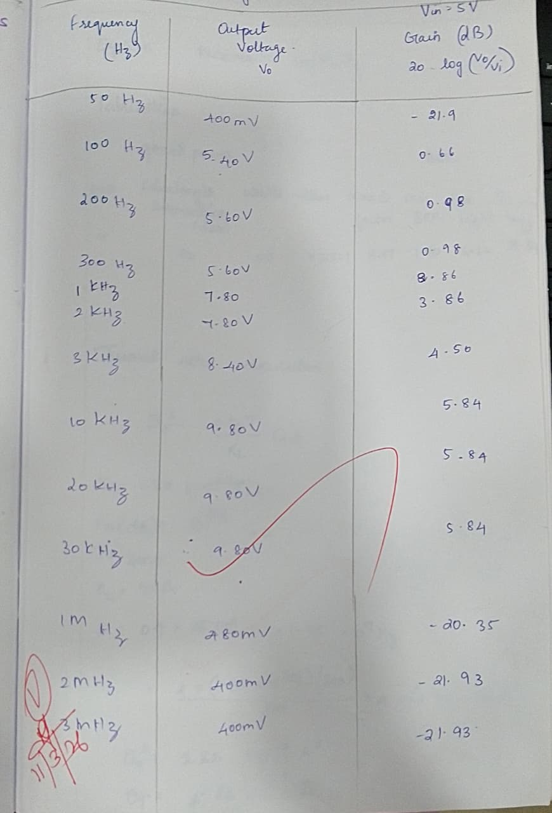
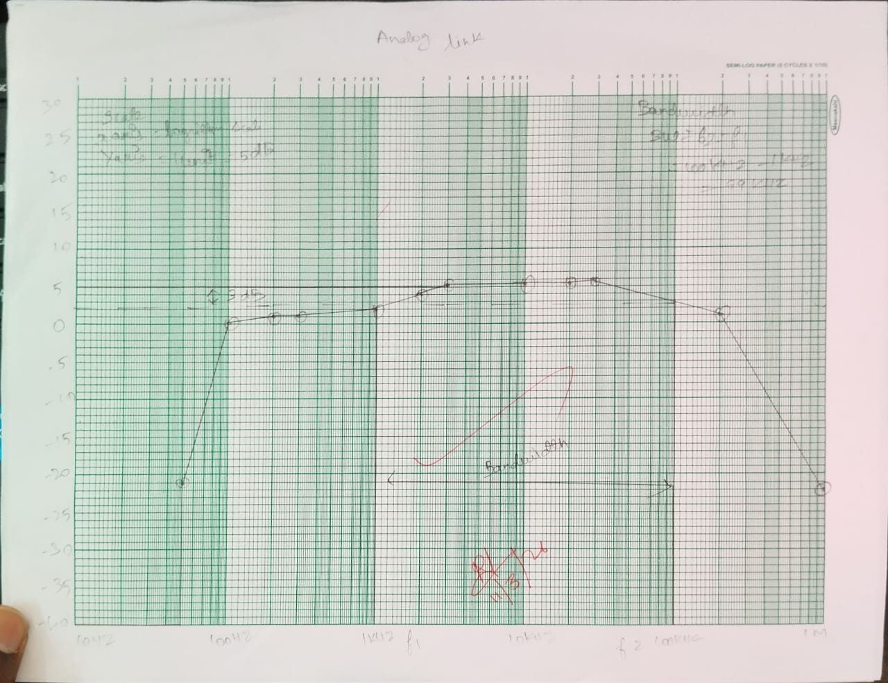

# Experimental-verification-of-frequency-response-of-Analog-fiber-optic-link
# Experiment: Fiber Analog Link (660nm & 950nm) and Frequency Response of Phototransistor Detector

## Aim
To study a 660nm & 950nm Fiber Analog Link and to analyze the frequency response of the phototransistor detector. The experiment investigates the relationship between the input signal and the received signal.

---

## Equipment Required
- Link-B Kit with power supply  
- Patch chords  
- 20 MHz Dual Channel Oscilloscope  
- 1 MHz Function Generator  
- 1 Meter Fiber Cable  

---

## Theory
Fiber optic links can transmit both digital and analog signals. A fiber optic link consists of three main elements:  
1. **Transmitter** – Converts electrical signals into optical signals using an LED.  
2. **Optical Fiber** – Serves as the transmission medium.  
3. **Receiver** – Converts optical signals back into electrical signals.

### Transmitter
- Composed of buffer, driver, and optical source.  
- Buffer provides electrical connection and isolation.  
- Driver powers the optical source to replicate the input signal.  
- Optical source (LED) converts electrical current to light energy.  
  - **SFH450V (950nm)**: Near infrared LED.  
  - **SFH756V (660nm)**: Visible red LED.  

### Receiver
- Converts optical energy into electrical signals.  
- Detector used: **SFH350V (Phototransistor Detector)**.  
- Responsivity: ~0.8 mA/10 µW at 660nm.  
- Bandwidth: ~300 kHz (limited by response time).  
- Output voltage is proportional to incident optical power and replicates transmitted signal.

---

## Procedure
1. Connect power supply to Link-B kit and switch ON.  
2. Set switches and jumpers:  
   - SW8 → TX  
   - SW9 → TX1  
   - JP5 → +12V  
   - JP6, JP9, JP10 → shorted  
   - JP8 → sine  
   - Pot P2 (Intensity control) → minimum  
3. Feed 2 Vpp sinusoidal signal (1 kHz) from function generator to **IN** of Analog Buffer.  
4. Connect **OUT** of Analog Buffer → **TX IN** of Transmitter.  
5. Connect fiber between SFH756V (660nm LED) and SFH350V detector.  
6. Observe detected signal at **ANALOG OUT** on oscilloscope.  
7. Adjust P2 until received signal amplitude ≈ 2 Vpp.  
8. Vary input frequency and record detected signal amplitude.  
9. Plot detected signal vs. frequency to determine **3 dB bandwidth**.  
10. Switch SW9 → TX2, JP7 → +12V.  
11. Replace fiber connection to SFH450V (950nm LED).  
12. Observe detected signal at **ANALOG OUT** on oscilloscope.  

---

## Tabulation

---

## Model Graph
- Plot **Gain (dB)** vs. **Frequency (Hz)**.  
- Identify the **3 dB down point** to determine bandwidth.  

---

## Result

The frequency response of the phototransistor detector was studied. The 3 dB bandwidth was determined from the gain vs. frequency plot for both 660nm and 950nm fiber analog links.
